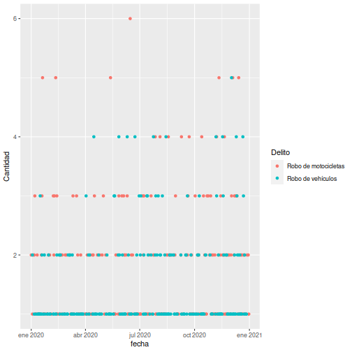
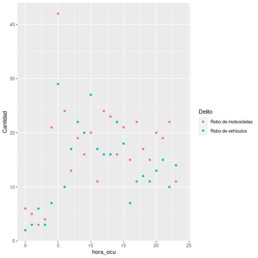
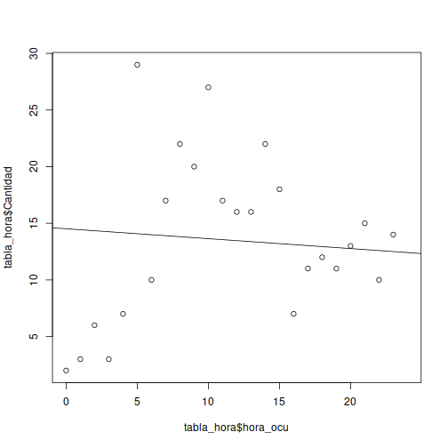

## Descripition

This is a small exploration of the crimes reported by the National Civil Police in the Republic of Guatemala, this information was taken from the site https://www.ine.gob.gt/ine/estadisticas/bases-de-datos/hechos-delictivos/

And can be viewed on the site https://ereb2002.shinyapps.io/crimeinguatemala/

The variables considered are:
* Incident department
* Description of the crime
* Crime date
* Time of crime

---  

## Visualization

You can display the information by dates.

---

## Visualization

You can display the information by hours.

---

## Visualization

